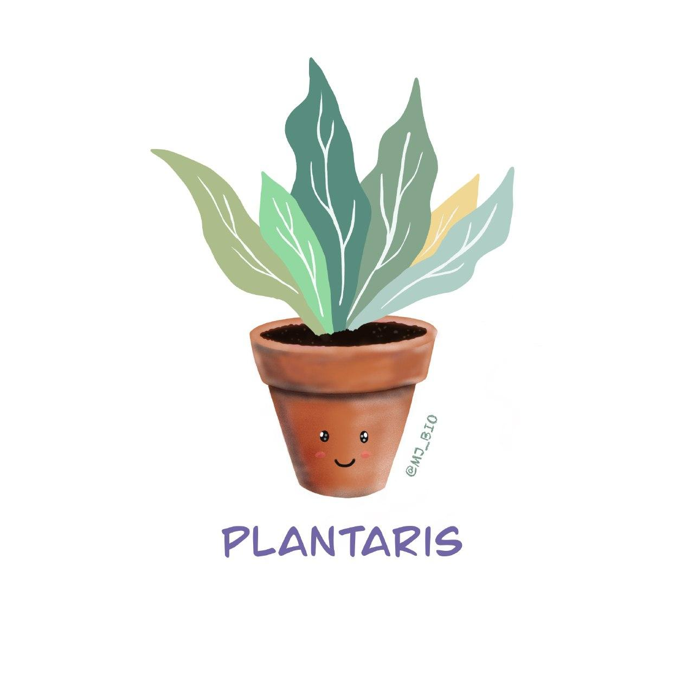
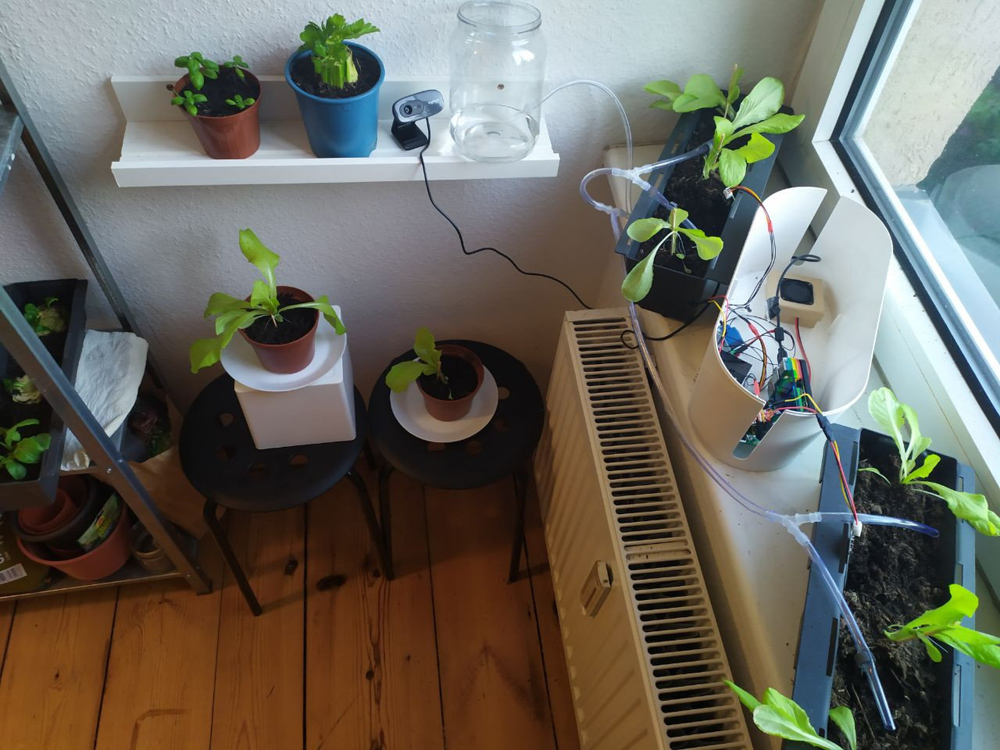

# Plantaris
## PyCon US 2020 :herb: :seedling: :yellow_heart: 🐍

This repository contains all the information related to my PyConUS 2020
talk entitled:

**"How to build an intelligent “indoor garden” with microcontrollers,
CircuitPython, and IoT." 

You can watch the talk [here](https://youtu.be/8STo1-rRV1E)!.

Check the [code/](code/) directory to see all the examples used in the talk
and project.

Check the [materials/](materials/) directory to get the information related
components, configuration, photos, and more!

## Talk description

Most people around the world are getting more and more interested in living a
long and healthy life nowadays. And many studies have proven that growing
house plants, as long as being a trend, improves health.
The truth is, we are so busy with work, and even when we get home, that we do
not have enough time to properly water our plants when they need it.

In this talk, you are going to learn how to build a functional and beginner
friendly system to keep your plants alive using different sensors,
microcontrollers and CircuitPython.

This system is going to water your plants based on their necessities and,
step by step, you are going to add components and functionalities to the
system; for instance, you will give your plants “a voice” to inform you
about their deficiencies.
Moreover, in this project, you will learn how to create a Web application
with Flask, how to set up a Raspberry Pi as a local server and how to use a
cloud IoT service for Data Analysis.

Finally, you will see how Circuitpython can play an amazing role in these
kind of situations, by helping plants to survive longer, and by making our
responsibility lighter.
This will also help you to understand that it is an excellent choice to start
programming hardware and connected devices for everyone!

## Audience 
1. This talk/project is beginner friendly. The main idea of this talk/project
   is show with a practical example (indoor garden) that programming hardware
   with CircuitPython is useful and easy.
2. With this project, you will learn: How to code hardware with CircuitPython
   microcontrollers, and some other topics such as example: Flask, Raspberry
   set up and some Plant Biology.
3. The background knowledge should be basic python knowledge.
