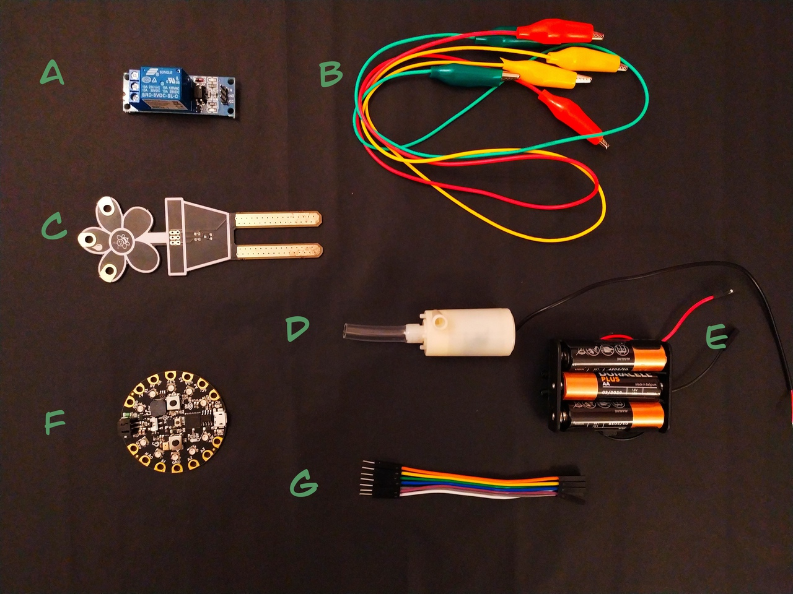
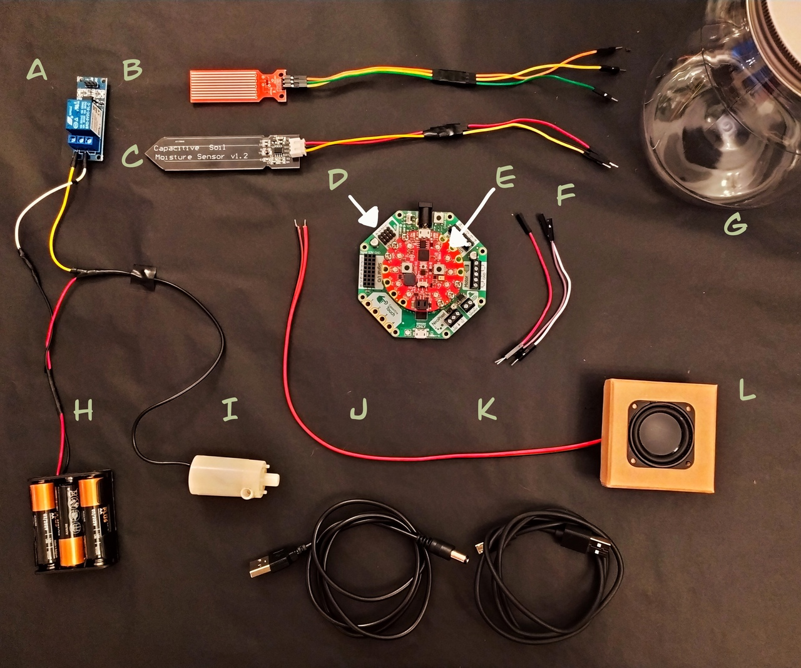
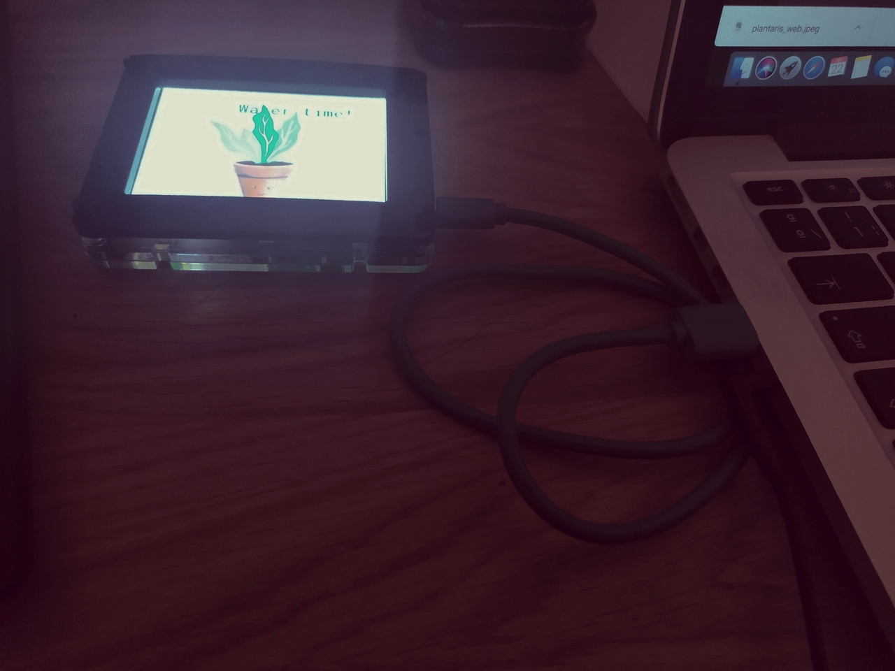
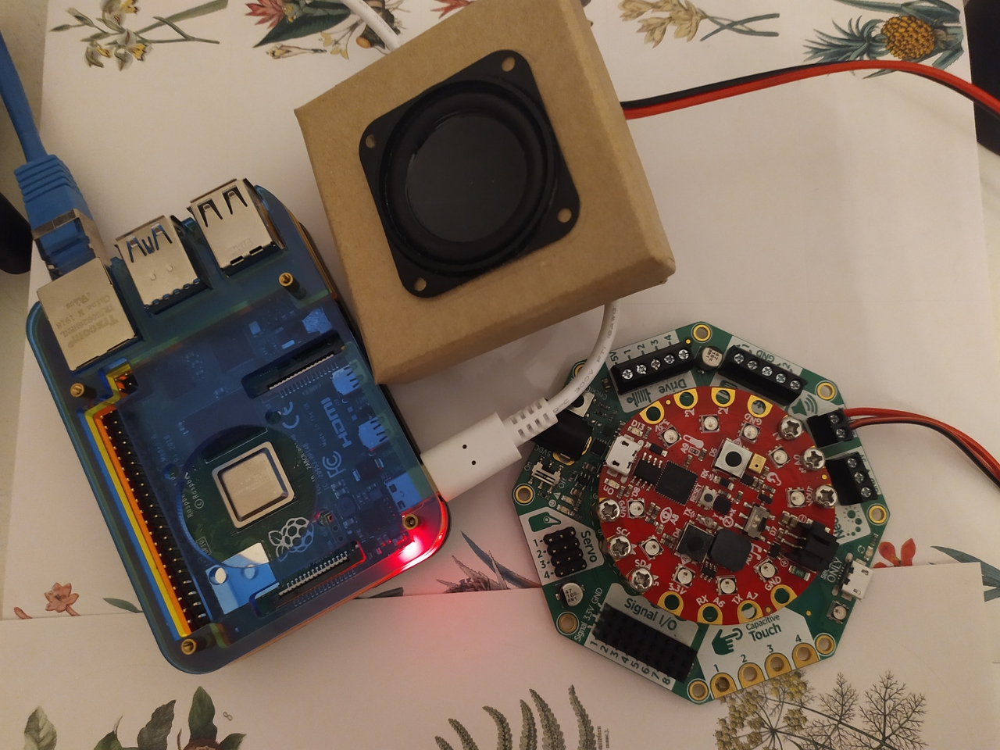

# Materials

## PyCon US 2020 Materials :herb: :seedling: :yellow_heart: 🐍

### System 1

* **A**: Relay 5V (brand: Songle)
* **B**: Alligator Test Leads (brand: Pimoroni)
* **C**: Resistive moisture soil sensor (brand: Micro:bit)
* **D**: Horizontal mini water pump 5V (brand: No specified) + silicone tube 
* **E**: Batteries 3x (AA) + Bateries holder (holder brand: Goobay)
* **F**: Circuit Playground Express (brand: Adafruit)
* **G**: Jumper Jerky (brand: Pimoroni)

### System 2

* **A**: Relay 5V (brand: Songle)
* **B**: Water level sensor 5V (brand: Aideepen) 
* **C**: Capacitive moisture soil sensor (brand: Sun3Drucker)
* **D**: Crickit (brand: Adafruit)
* **E**: Circuit Playground Express (brand: Adafruit)
* **F**: Jumper Jerky (brand: Pimoroni)
* **G**: Water tank (brand: No specified)
* **H**: Batteries 3x (AA)+ Bateries holder (holder brand: Goobay)
* **I**: Horizontal mini water pump 5V (brand: No specified) + silicone tube 
* **J**: USB barrel Cable 5V (brand: No specified)
* **K**: USB A cable (brand: MicroB)
* **L**: Mini Speaker 4Ω (brand: Pimoroni)

### New component for IoT (using Circuitpython):

Pyportal (brand: Adafruit)

### System 2 with IoT (using python): 

Raspberry pi 4
